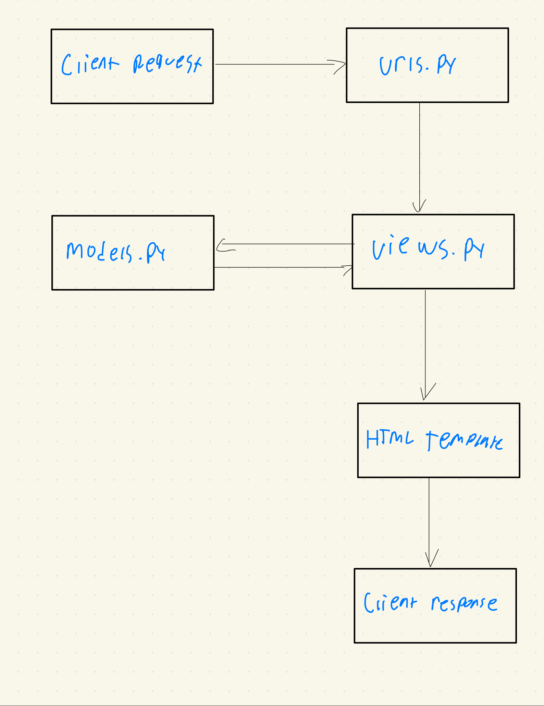
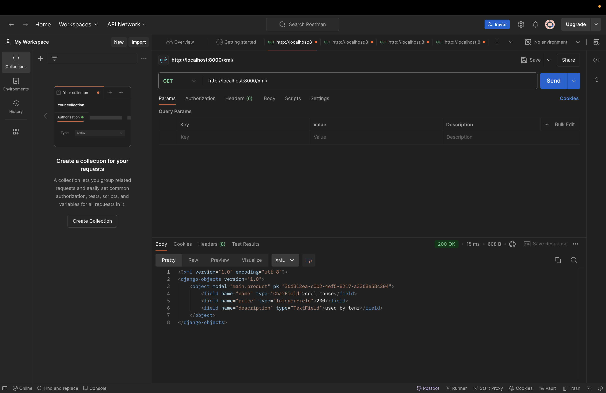
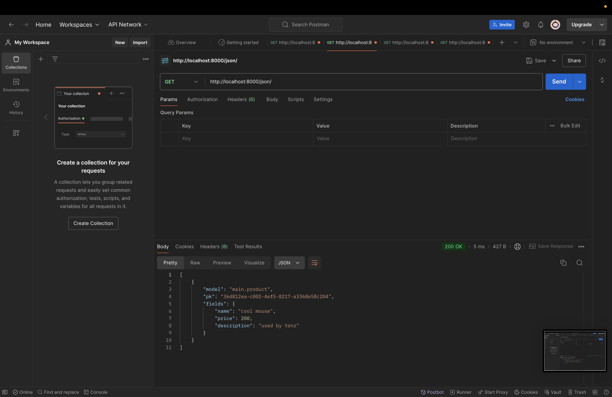
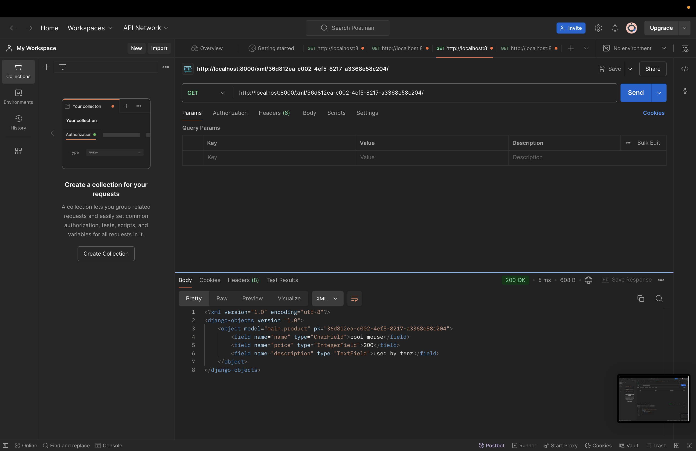
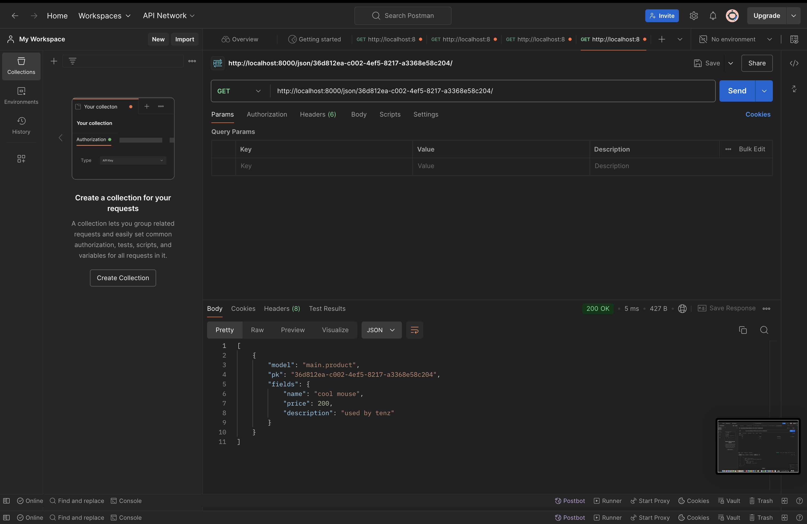

# Assignment 1


# E-Commerce Django Project

This README contains the step-by-step guide to set up a simple Django project with an e-commerce app.

## Steps for Implementation

### 1. Install Django
If you haven't installed Django yet, run the following command to install it:

```bash
pip install django
```

### 2. Create a New Django Project
Create a new Django project using the following command:

```bash
django-admin startproject e_commerce_app
```

Navigate to the project folder:

```bash
cd e_commerce_app
```

### 3. Create an Application within the Project
Inside your project, create an application named `main` by running:

```bash
python manage.py startapp main
```

### 4. Add the Application to Installed Apps
To ensure Django recognizes the new app, add `main` to the `INSTALLED_APPS` section of your `e_commerce_app/settings.py`:

```python
# e_commerce_app/settings.py

INSTALLED_APPS = [
    # other installed apps
    'main',
]
```

### 5. Perform Routing to Ensure the Application Runs
Create a `urls.py` file inside the `main` app by running:

```bash
touch main/urls.py
```

In `main/urls.py`, define your routes as follows:

```python
# main/urls.py

from django.urls import path
from . import views

urlpatterns = [
    path('', views.home, name='home'),
]
```

Now, link the `main/urls.py` to your project’s `urls.py`:

```python
# e_commerce_app/urls.py

from django.contrib import admin
from django.urls import path, include

urlpatterns = [
    path('admin/', admin.site.urls),
    path('', include('main.urls')),  # This includes the URLs from the 'main' app
]
```

### 6. Create a Model for the Application
In `main/models.py`, create a simple Product model with mandatory attributes:

```python
# main/models.py

from django.db import models

class Product(models.Model):
    name = models.CharField(max_length=255)  # Item name
    price = models.IntegerField()  # Item price
    description = models.TextField()  # Item description
    
    def __str__(self):
        return self.name
```

Run the following commands to apply the model changes to the database:

```bash
python manage.py makemigrations
python manage.py migrate
```

### 7. Create a View Function to Return an HTML Template
In `main/views.py`, create a simple view that renders an HTML template:

```python
# main/views.py

from django.shortcuts import render

def home(request):
    return render(request, 'main/home.html')
```

### 8. Create a Template for the Application
Create the `home.html` template in `main/templates/main/`:

```bash
mkdir -p main/templates/main
touch main/templates/main/home.html
```

Add some basic content to `home.html`:

```html
<!-- main/templates/main/home.html -->

<!DOCTYPE html>
<html>
<head>
    <title>{{ app_name }}</title>
</head>
<body>
    <h1>Welcome to {{ app_name }}!</h1>
    <p>Developed by: {{ developer_name }}</p>
    <p>Class: {{ class_name }}</p>

</body>
</html>

```

### 9. Map URLs to the Views
Ensure that the home view is mapped correctly in `main/urls.py`, as defined earlier in Step 5.

---

You have now successfully created a basic Django e-commerce project with a `main` app that includes routing, views, models, and a simple HTML template.

To run the server, use the command:

```bash
python manage.py runserver
```

Open your browser and go to `http://127.0.0.1:8000` to view your project!


# Diagram and Explanation : 



## 1. Client Request
The client (user) sends an HTTP request to the server. This could be a `GET` or `POST` request depending on the type of action (e.g., requesting a webpage or submitting form data). 

## 2. `urls.py`
This file is responsible for handling URL routing. It matches incoming request URLs to specific view functions defined in `views.py`.

### Example:
```python
from django.urls import path
from . import views

urlpatterns = [
    path('home/', views.home, name='home'),
]
```

- **Explanation**: In the above example, when the client sends a request to `/home/`, Django uses this file to route the request to the `home` view function in `views.py`.

## 3. `views.py`
The view receives and processes the request. It may interact with the database (via `models.py`) or simply render a template (HTML file) to return as an HTTP response.

### Example:
```python
from django.shortcuts import render

def home(request):
    return render(request, 'home.html')
```

- **Explanation**: In this example, the `home` function processes the client’s request and responds by rendering the `home.html` template, which is sent back as the response.

## 4. `models.py` (Optional)
If the view function needs to interact with the database, it makes use of models, which are defined in `models.py`. Models represent the structure of the database and provide an interface for interacting with it (e.g., querying, inserting, or updating data).

### Example:
```python
from django.db import models

class Product(models.Model):
    name = models.CharField(max_length=255)  # Item name
    price = models.IntegerField()  # Item price
    description = models.TextField()  # Item description
    
    def __str__(self):
        return self.name
```

- **Explanation**: The `Item` model defines a database table with a single `name` field that holds strings of up to 100 characters. The view can use this model to query the database or modify its contents.

## 5. HTML File (Template)
The template represents the front-end part of the application. It is a file (e.g., `home.html`) that is rendered with data (if any) passed from the view function. Once rendered, it is returned as an HTTP response to the client.

---

## Example Workflow:
1. The client sends an HTTP request to `/home/`.
2. Django uses `urls.py` to map the request to the `home` view function in `views.py`.
3. The `home` view function processes the request and renders the `home.html` template.
4. The rendered HTML is returned to the client as the HTTP response and is displayed in the browser.

---

# Git in Software Development : 

Git is a distributed version control system used to:

- Track changes in code and revert to previous versions if needed.
- Collaborate on code with multiple developers through branching and merging.
- Maintain history of changes for debugging and auditing.
- Enable backups through its distributed nature.

Git is essential for collaborative software development, especially in open-source and CI/CD environments.


# Why Django for Learning Software Development?

Django is popular for beginners because:

- It's a high-level framework that simplifies web development.
- It has a "batteries included" philosophy, offering built-in features like authentication, admin panel, and ORM.
- Clear documentation and strong community support help learners.
- It uses Python, an easy-to-learn language.
- Django scales well and is used in real-world applications, offering valuable learning experiences.


# Why is the Django Model Called an ORM?

Django’s models are called an ORM (Object-Relational Mapping) because they map database tables to Python objects. The ORM allows developers to interact with the database using Python code instead of SQL, making database interactions easier and database-agnostic.

---
# Assignment 2


# E-Commerce Project

This project is a simple Django-based e-commerce application. It includes functionalities for creating products with UUIDs, form inputs, and returning product data in XML and JSON formats.

## Getting Started
To get started with this project, clone the repository and set up the Django environment. Make sure you have Django installed and set up a virtual environment if necessary.

## Implementing the Skeleton of a View

### a. Create a Base Template

1. Create a directory named `templates` in the root folder of your project.
2. Create a file named `base.html` inside the `templates` directory with the following content:

```html


<!DOCTYPE html>
<html lang="en">
<head>
    <meta charset="UTF-8" />
    <meta name="viewport" content="width=device-width, initial-scale=1.0" />
     
</head>
<body>
     
</body>
</html>

```

### b. Adjust `settings.py`

Open `settings.py` and locate the `TEMPLATES` variable. Modify the `DIRS` option as follows:

```python
TEMPLATES = [
    {
        'BACKEND': 'django.template.backends.django.DjangoTemplates',
        'DIRS': [BASE_DIR / 'templates'],  # Add this line
        'APP_DIRS': True,
        ...
    }
]
```

### c. Extend the Base Template in `home.html`

Update `home.html` to use the `base.html` template:

```html



<h1>Welcome to {{ app_name }}!</h1>
<p>Developed by: {{ developer_name }}</p>
<p>Class: {{ class_name }}</p>


```

## Changing the Primary Key From Integer to UUID

### a. Update `models.py`

Modify the Product model to use a UUID primary key:

```python
import uuid
from django.db import models

class Product(models.Model):
    id = models.UUIDField(primary_key=True, default=uuid.uuid4, editable=False)  # Add this line
    name = models.CharField(max_length=255)
    price = models.IntegerField()
    description = models.TextField()
    
    def __str__(self):
        return self.name
```

Perform a migration to apply this change:

```bash
python manage.py makemigrations
python manage.py migrate
```

## Creating Form Input for Product

### a. Create `forms.py`

Create a file named `forms.py` in the same directory as `models.py` and add:

```python
from django.forms import ModelForm
from .models import Product

class ProductForm(ModelForm):
    class Meta:
        model = Product
        fields = ["name", "price", "description"]
```

### b. Update `views.py` to Handle Form Submission

Modify `views.py` to include a new view for creating products:

```python
from django.shortcuts import render, redirect
from .forms import ProductForm
from .models import Product

def create_product(request):
    form = ProductForm(request.POST or None)
    if form.is_valid() and request.method == "POST":
        form.save()
        return redirect('home')
    
    context = {'form': form}
    return render(request, "create_product.html", context)

def home(request):
    products = Product.objects.all()
    context = {
        'app_name': 'E-Commerce App',
        'developer_name': 'Muhammad Raditya Indrastata Norman',
        'class_name': 'KKI',
        'products': products
    }
    return render(request, 'home.html', context)
```

### c. Create `create_product.html`

Create a file named `create_product.html` in the `templates` directory:

```html



<h1>Add New Product</h1>
<form method="POST">
  
  <table>
    {{ form.as_table }}
    <tr>
      <td></td>
      <td><input type="submit" value="Add Product" /></td>
    </tr>
  </table>
</form>


```

### d. Update `urls.py`

Add the URL path for creating a product:

```python
from .views import home, create_product

urlpatterns = [
    path('', home, name='home'),
    path('create-product/', create_product, name='create_product'),
]
```

## Returning Data in XML and JSON Formats

### a. Update `views.py` for XML and JSON Responses

Add views to return data in XML and JSON formats:

```python
from django.http import HttpResponse
from django.core import serializers

def show_xml(request):
    data = Product.objects.all()
    return HttpResponse(serializers.serialize("xml", data), content_type="application/xml")

def show_json(request):
    data = Product.objects.all()
    return HttpResponse(serializers.serialize("json", data), content_type="application/json")
```

### b. Update `urls.py`

Add paths for the XML and JSON views:

```python
from .views import home, create_product, show_xml, show_json

urlpatterns = [
    path('', home, name='home'),
    path('create-product/', create_product, name='create_product'),
    path('xml/', show_xml, name='show_xml'),
    path('json/', show_json, name='show_json'),
]
```

## Returning Data Based on an ID in XML and JSON Format

### a. Update `views.py` to Filter by ID

Add views for filtering data by ID:

```python
def show_xml_by_id(request, id):
    data = Product.objects.filter(pk=id)
    return HttpResponse(serializers.serialize("xml", data), content_type="application/xml")

def show_json_by_id(request, id):
    data = Product.objects.filter(pk=id)
    return HttpResponse(serializers.serialize("json", data), content_type="application/json")
```

### b. Update `urls.py`

Add paths for the filtered XML and JSON views:

```python
from .views import home, create_product, show_xml, show_json, show_xml_by_id, show_json_by_id

urlpatterns = [
    path('', home, name='home'),
    path('create-product/', create_product, name='create_product'),
    path('xml/', show_xml, name='show_xml'),
    path('json/', show_json, name='show_json'),
    path('xml/<str:id>/', show_xml_by_id, name='show_xml_by_id'),
    path('json/<str:id>/', show_json_by_id, name='show_json_by_id'),
]
```

## Testing the Changes

Run the server and navigate to different paths to ensure everything works:

```bash
python manage.py runserver
```

## Questions and Answers

### 1. Explain why we need data delivery in implementing a platform.
Data delivery is crucial in implementing a platform because it facilitates the exchange of information between the client and server. It allows platforms to dynamically present data, interact with users, and update content without requiring a full page reload. Efficient data delivery ensures that users receive the latest information quickly, improving user experience and engagement. It also supports functionalities like form submissions, search operations, and real-time updates.

### 2. In your opinion, which is better, XML or JSON? Why is JSON more popular than XML?
JSON is generally considered better than XML for several reasons:
- **Simplicity:** JSON has a simpler syntax that is easy to read and write for humans, while XML is more verbose with its tag-based structure.
- **Data Size:** JSON typically results in a smaller data size, making it more efficient to transmit over networks.
- **Parsing Speed:** JSON can be parsed more quickly by most programming languages, including JavaScript, which has built-in support for JSON through `JSON.parse()`.
- **Interoperability:** JSON is directly usable in JavaScript, making it a natural fit for web development.

JSON is more popular than XML because of these advantages, particularly in web applications where efficient, lightweight data exchange is crucial. Its seamless integration with JavaScript and support across modern web APIs further contribute to its widespread use.

### 3. Explain the functional usage of `is_valid()` method in Django forms. Also explain why we need the method in forms.
The `is_valid()` method in Django forms is used to validate the form data. When this method is called, it checks if all form fields contain valid data according to the validation rules defined in the form. If the form is valid, `is_valid()` returns `True` and populates the `cleaned_data` attribute with the sanitized data. If the form is not valid, it returns `False` and stores error messages in the `errors` attribute.

We need the `is_valid()` method in forms to ensure that the data being submitted by the user is correct and safe to use. It helps prevent the submission of incomplete or incorrect data and protects the application from potential security vulnerabilities, such as SQL injection or cross-site scripting (XSS) attacks, by ensuring that only validated data is processed.

### 4. Why do we need `csrf_token` when creating a form in Django? What could happen if we did not use `csrf_token` on a Django form? How could this be leveraged by an attack?
The `csrf_token` is a security measure used in Django forms to protect against Cross-Site Request Forgery (CSRF) attacks. CSRF is an attack where a malicious website tricks users into performing unwanted actions on a different website where they are authenticated (e.g., transferring funds, changing account details).

When a form includes a `csrf_token`, Django generates a unique token for each session and validates it upon form submission. This ensures that the request is coming from a trusted source and not from an unauthorized third party.

If we did not use `csrf_token` on a Django form, attackers could exploit this vulnerability by creating a malicious form on their site that submits data to your site on behalf of an authenticated user, potentially causing harm. For example, they could trick a user into making an unintended purchase or changing account information without their knowledge.

In summary, using `csrf_token` is essential for securing forms against CSRF attacks and ensuring that requests are genuine and authorized.

---
## Postman Screenshots : 





---
# Assingment 3

## 1. What is a UserCreationForm?

The `UserCreationForm` is a form provided by Django’s authentication system, specifically designed to handle the registration of new users. It is part of `django.contrib.auth.forms`. This form includes fields for creating a new user, such as:
- `username`
- `password1` (with password validation)
- `password2` 

### Advantages:
- **Pre-built and secure**: It includes built-in password hashing and validation, ensuring security.
- **Simplicity**: Reduces the need to create user registration functionality from scratch.
- **Customizable**: You can easily override or extend the form to add custom fields or validation rules.
- **Integration with Django's Authentication System**: Seamlessly integrates with the authentication system, providing ease in managing user data.

### Disadvantages:
- **Limited out of the box**: The default form only includes basic fields, so additional customization is required if you want more user data during registration.
- **Complexity with customization**: Overriding or adding custom validation can become complex if the default behavior doesn’t suit your needs.
- **Coupled with Django’s built-in user model**: If you are using a custom user model, the default form may not cover all the necessary fields, requiring additional configuration.

## 2. Difference Between Authentication and Authorization in Django

- **Authentication**: Verifying if a user is who they claim to be. This is typically done through username and password, where the user provides credentials, and the system checks if they are correct.
- **Authorization**: Determining what a user is allowed to do once authenticated. Django uses permissions and groups to manage what users can access, such as pages or resources on a site.

### Importance of Both:
- **Authentication**: Ensures that only legitimate users can access the system, preventing unauthorized individuals from gaining access.
- **Authorization**: Restricts access to different parts of the system, ensuring authenticated users only interact with resources they are permitted to access.

## 3. What are Cookies in Web Development?

Cookies are small pieces of data that a server sends to a user's web browser. They are stored locally on the user's machine and are sent back to the server with each subsequent request. They are often used to maintain session state, user preferences, and other small bits of information.

### Django’s Use of Cookies for Managing User Sessions:
In Django, cookies manage user sessions. Specifically, the session framework stores session data on the server and uses cookies to track session IDs on the client side. When a user logs in, Django creates a session cookie that contains the session ID, corresponding to session data stored on the server.

## 4. Are Cookies Safe by Default in Web Development?

Cookies are generally safe when properly managed, but there are security risks:

### Risks:
- **Session Hijacking**: If an attacker gains access to a user's session cookie, they can impersonate that user.
- **Cross-Site Scripting (XSS)**: An attacker could inject malicious scripts that steal session cookies if a website is vulnerable.
- **Cross-Site Request Forgery (CSRF)**: Cookies can be exploited by attackers to perform unwanted actions on behalf of users.

### Mitigation:
- **Secure flag**: Ensures cookies are only sent over HTTPS, preventing interception over insecure connections.
- **HttpOnly flag**: Prevents client-side scripts from accessing the cookie, reducing the risk of XSS attacks.
- **SameSite attribute**: Helps protect against CSRF attacks by restricting when cookies are sent with cross-site requests.

---
# Step by Step


### 1. Implementing User Registration

#### a. Modify `views.py` for Registration

Open `views.py` and import `UserCreationForm` and `messages`:

```python
from django.contrib.auth.forms import UserCreationForm
from django.contrib import messages
from django.shortcuts import redirect
```

Add the `register` function to handle user registration:

```python
def register(request):
    form = UserCreationForm()

    if request.method == "POST":
        form = UserCreationForm(request.POST)
        if form.is_valid():
            form.save()
            messages.success(request, 'Your account has been successfully created!')
            return redirect('login')
    context = {'form': form}
    return render(request, 'register.html', context)
```

#### b. Create `register.html` Template

Create `register.html` in the `main/templates` directory with the following content:

```html



<title>Register</title>



<div class="register">
  <h1>Register</h1>

  <form method="POST">
    
    <table>
      {{ form.as_table }}
      <tr>
        <td></td>
        <td><input type="submit" name="submit" value="Register" /></td>
      </tr>
    </table>
  </form>

  
  <ul>
    
    <li>{{ message }}</li>
    
  </ul>
  
</div>

```

#### c. Add URL for Registration

Open `urls.py` in the `main` subdirectory and add the import for `register`:

```python
from main.views import register
```

Add the URL path to `urlpatterns`:

```python
urlpatterns = [
    ...
    path('register/', register, name='register'),
]
```

### 2. Implementing User Login

#### a. Modify `views.py` for Login

Import `AuthenticationForm`, `authenticate`, and `login` in `views.py`:

```python
from django.contrib.auth.forms import AuthenticationForm
from django.contrib.auth import authenticate, login
```

Add the `login_user` function:

```python
def login_user(request):
    if request.method == 'POST':
        form = AuthenticationForm(data=request.POST)

        if form.is_valid():
            user = form.get_user()
            login(request, user)
            return redirect('home')  # Redirect to home page after login
    else:
        form = AuthenticationForm()
    context = {'form': form}
    return render(request, 'login.html', context)
```

#### b. Create `login.html` Template

Create `login.html` in the `main/templates` directory:

```html



<title>Login</title>



<div class="login">
  <h1>Login</h1>

  <form method="POST">
    
    <table>
      {{ form.as_table }}
      <tr>
        <td></td>
        <td><input class="btn login_btn" type="submit" value="Login" /></td>
      </tr>
    </table>
  </form>

  
  <ul>
    
    <li>{{ message }}</li>
    
  </ul>
   Don't have an account yet?
  <a href="">Register Now</a>
</div>

```

#### c. Add URL for Login

Open `urls.py` and add the import for `login_user`:

```python
from main.views import login_user
```

Add the URL path to `urlpatterns`:

```python
urlpatterns = [
    ...
    path('login/', login_user, name='login'),
]
```

### 3. Implementing User Logout

#### a. Modify `views.py` for Logout

Import `logout` in `views.py`:

```python
from django.contrib.auth import logout
```

Add the `logout_user` function:

```python
def logout_user(request):
    logout(request)
    return redirect('login')  # Redirect to login page after logout
```

#### b. Add Logout Button to `home.html`

Update `home.html` to include a logout button:

```html
<a href="">
  <button>Logout</button>
</a>
```

#### c. Add URL for Logout

Open `urls.py` and add the import for `logout_user`:

```python
from main.views import logout_user
```

Add the URL path to `urlpatterns`:

```python
urlpatterns = [
    ...
    path('logout/', logout_user, name='logout'),
]
```

### 4. Restricting Access to the Main Page

#### a. Restrict Access to Views

Import `login_required` in `views.py`:

```python
from django.contrib.auth.decorators import login_required
```

Apply the `@login_required` decorator to the `home` view:

```python
@login_required(login_url='/login')
def home(request):
    ...
```

### 5. Using Data from Cookies

#### a. Modify `views.py` to Track Last Login

Add the imports for `HttpResponseRedirect`, `reverse`, and `datetime`:

```python
import datetime
from django.http import HttpResponseRedirect
from django.urls import reverse
```

Update the `login_user` function to set a cookie:

```python
if form.is_valid():
    user = form.get_user()
    login(request, user)
    response = HttpResponseRedirect(reverse('home'))
    response.set_cookie('last_login', str(datetime.datetime.now()))
    return response
```

Update `home` to include last login data:

```python
def home(request):
    products = Product.objects.filter(user=request.user)
    context = {
        'app_name': 'E-Commerce App',
        'developer_name': 'Muhammad Raditya Indrastata Norman',
        'class_name': 'KKI',
        'products': products,
        'last_login': request.COOKIES.get('last_login'),
    }
    return render(request, 'home.html', context)
```

Modify the `logout_user` function to delete the cookie:

```python
def logout_user(request):
    logout(request)
    response = HttpResponseRedirect(reverse('login'))
    response.delete_cookie('last_login')
    return response
```

#### b. Update `home.html` to Display Last Login

Add the last login data display to `home.html`:

```html
<h5>Last login session: {{ last_login }}</h5>
```

### 6. Linking Products to Users

#### a. Modify Product Model

Open `models.py` and add the `User` model:

```python
from django.contrib.auth.models import User
```

Update the Product model to include a `ForeignKey` to User:

```python
class Product(models.Model):
    user = models.ForeignKey(User, on_delete=models.CASCADE)
    name = models.CharField(max_length=255)
    price = models.IntegerField()
    description = models.TextField()
```

#### b. Update `create_product` Function

Modify `views.py` to link the product to the logged-in user:

```python
def create_product(request):
    form = ProductForm(request.POST or None)

    if form.is_valid() and request.method == "POST":
        product = form.save(commit=False)
        product.user = request.user
        product.save()
        return redirect('home')

    context = {'form': form}
    return render(request, "create_product.html", context)
```

#### c. Filter Products by User in `home` View

Modify the `home` view to show products related to the logged-in user:

```python
def home(request):
    products = Product.objects.filter(user=request.user)
    context = {
        'app_name': 'E-Commerce App',
        'developer_name': 'Muhammad Raditya Indrastata Norman',
        'class_name': 'KKI',
        'products': products,
        'last_login': request.COOKIES.get('last_login'),
    }
    return render(request, 'home.html', context)
```

### 7. Run Migrations

Run migrations to apply changes to the Product model:

```bash
python manage.py makemigrations
python manage.py migrate
```

If prompted to provide a default user, choose an appropriate option (like selecting user ID 1).

### 8. Test the Implementation

Start the Django server:

```bash
python manage.py runserver
```

Test the registration, login, and product creation to ensure everything is linked to the user correctly.
---
# Assignment 5

# CSS Selectors Priority Order

When multiple CSS selectors target the same HTML element, the browser determines which one to apply based on specificity. The order of priority is as follows:

1. **Inline Styles** (e.g., `style="color: red;"`) – Highest priority.
2. **ID Selectors** (e.g., `#elementID`) – More specific than class or tag selectors.
3. **Class, Attribute, and Pseudo-Class Selectors** (e.g., `.class`, `[attribute=value]`, `:hover`) – Less specific than IDs.
4. **Tag and Pseudo-Element Selectors** (e.g., `div`, `p`, `:before`, `:after`) – Lowest priority.
5. **Universal Selectors** (e.g., `*`) – Applies to all elements but has the lowest specificity.
6. **!important** overrides – Any declaration with `!important` will override all other styles unless another `!important` is also applied with higher specificity.

For example:
```css
#id-selector {
  color: blue;
}

.class-selector {
  color: green;
}

element-selector {
  color: red;
}

<p id="id-selector" class="class-selector">This text will be blue due to higher specificity of the ID selector.</p>
```

# Why Responsive Design is Important

Responsive design allows web applications to adapt seamlessly to different screen sizes, enhancing user experience across devices (desktop, tablet, smartphone). It's crucial because users now access the web on a variety of devices, and without responsive design, a website may look broken or difficult to use on smaller screens.

### Examples of Applications:
- **With Responsive Design**: 
  - **Twitter**: Automatically adjusts its layout for mobile users, showing a simplified feed and easy-to-navigate interface.
  - **Amazon**: Changes its navigation and content layout to fit different screen sizes.
  
- **Without Responsive Design**: 
  - **Older Websites**: Many older websites built before responsive design practices may only cater to desktops, rendering poorly on mobile devices, forcing users to zoom and scroll horizontally.
  - **Local Business Websites**: Some smaller businesses may not have updated their websites to be responsive, leading to a suboptimal experience on phones or tablets.

# Margin, Border, and Padding

In CSS, **margin**, **border**, and **padding** are used to create space around elements. Here’s the difference:

1. **Margin**: Space outside the element's border. It creates space between the element and other elements.
2. **Border**: A line around the element’s padding and content. It defines the edge of the element.
3. **Padding**: Space inside the element, between the content and the border. It pushes the content away from the edges of the element.

### Example Implementation:
```css
element {
  margin: 20px;  /* Adds space outside the element */
  border: 2px solid black;  /* Adds a solid black border */
  padding: 10px;  /* Adds space inside the element */
}
```


# Flexbox and Grid Layout

## Flexbox

Flexbox is a CSS layout module designed to distribute space and align items within a container. It is particularly useful for creating one-dimensional layouts, where you need to align items in a row or column.

### Example Use:
```css
.container {
  display: flex;
  justify-content: center;  /* Centers items horizontally */
  align-items: center;  /* Centers items vertically */
}
```
In this example, all elements inside the `.container` will be centered both horizontally and vertically. Flexbox is ideal for layouts like navigation bars, footers, or simple content layouts where elements need to be aligned along a single axis.

### Properties:
- **justify-content**: Aligns items horizontally (start, center, end, space-around, space-between).
- **align-items**: Aligns items vertically (stretch, center, baseline).
- **flex-direction**: Specifies the direction (row or column).
- **flex-wrap**: Determines if items should wrap or stay in a single line.

## Grid Layout

CSS Grid is a powerful two-dimensional layout system. It allows you to create complex layouts involving rows and columns.

### Example Use:
```css
.grid-container {
  display: grid;
  grid-template-columns: repeat(3, 1fr);  /* Creates 3 equal columns */
  grid-gap: 10px;  /* Space between grid items */
}

.grid-item {
  background-color: lightblue;
}
```

### Properties:
- **grid-template-columns**: Defines the number of columns.
- **grid-template-rows**: Defines the number of rows.
- **grid-gap**: Sets the space between rows and columns.
- **grid-area**: Allows items to span across multiple rows or columns.

CSS Grid is particularly useful for building more complex web layouts, such as a webpage’s overall structure with headers, sidebars, main content areas, and footers.

### Flexbox vs Grid:
- **Flexbox** is best for one-dimensional layouts (either row or column).
- **Grid** is best for two-dimensional layouts (both rows and columns).
---
# Step by Step

1. **User Authentication (Login & Register)**
    - Implemented user login and registration using Django's built-in authentication system.
    - Session management with cookies to store the last login time.

### Login View

```python
from django.contrib.auth import authenticate, login
from django.contrib.auth.forms import AuthenticationForm

def login_user(request):
    if request.method == 'POST':
        form = AuthenticationForm(request, data=request.POST)
        if form.is_valid():
            username = form.cleaned_data.get('username')
            password = form.cleaned_data.get('password')
            user = authenticate(username=username, password=password)
            if user is not None:
                login(request, user)
                response = redirect('home')
                response.set_cookie('last_login', str(datetime.datetime.now()))
                return response
    else:
        form = AuthenticationForm()
    return render(request, 'login.html', {'form': form})
```

### Register View

```python
from django.contrib.auth.forms import UserCreationForm
from django.contrib.auth import login

def register_user(request):
    if request.method == 'POST':
        form = UserCreationForm(request.POST)
        if form.is_valid():
            user = form.save()
            login(request, user)
            return redirect('home')
    else:
        form = UserCreationForm()
    return render(request, 'register.html', {'form': form})
```

2. **URL Configuration**

```python
from django.urls import path
from main.views import login_user, register_user
from django.contrib.auth.views import LogoutView

urlpatterns = [
    path('login/', login_user, name='login'),
    path('register/', register_user, name='register'),
    path('logout/', LogoutView.as_view(next_page='login'), name='logout'),
]
```

3. **HTML Templates for Login and Register**

### Login Page (login.html)

```html


  <div class="min-h-screen flex items-center justify-center w-screen bg-gray-100 py-12 px-4 sm:px-6 lg:px-8">
    <div class="max-w-md w-full space-y-8">
      <h2 class="text-3xl font-extrabold text-center text-gray-900">Login to your account</h2>
      <form method="POST" class="mt-8 space-y-6">
        
        {{ form.as_p }}
        <button type="submit" class="w-full bg-indigo-600 hover:bg-indigo-700 text-white py-2 px-4 rounded-md">Login</button>
      </form>
      <div class="text-center mt-4">
        <p>Don't have an account? 
          <a href="" class="text-indigo-600 hover:text-indigo-800">Register Now</a>
        </p>
      </div>
    </div>
  </div>

```

### Register Page (register.html)

```html


  <div class="min-h-screen flex items-center justify-center w-screen bg-gray-100 py-12 px-4 sm:px-6 lg:px-8">
    <div class="max-w-md w-full space-y-8">
      <h2 class="text-3xl font-extrabold text-center text-gray-900">Create your account</h2>
      <form method="POST" class="mt-8 space-y-6">
        
        {{ form.as_p }}
        <button type="submit" class="w-full bg-green-500 hover:bg-green-600 text-white py-2 px-4 rounded-md">Register</button>
      </form>
      <div class="text-center mt-4">
        <p>Already have an account? 
          <a href="" class="text-indigo-600 hover:text-indigo-800">Login Here</a>
        </p>
      </div>
    </div>
  </div>

```

4. **Navbar Template (navbar.html)**

```html
<!-- navbar.html -->
<nav class="bg-indigo-600 shadow-lg fixed top-0 left-0 z-40 w-screen">
    <div class="max-w-7xl mx-auto px-4 sm:px-6 lg:px-8">
      <div class="flex items-center justify-between h-16">
        <div class="flex items-center">
          <h1 class="text-2xl font-bold text-center text-white">E-Shop</h1>
        </div>
        <div class="hidden md:flex items-center">
          
            <span class="text-gray-300 mr-4">Welcome, {{ user.username }}</span>
            <a href="" class="text-center bg-red-500 hover:bg-red-600 text-white font-bold py-2 px-4 rounded transition duration-300">
              Logout
            </a>
          
            <a href="" class="text-center bg-blue-500 hover:bg-blue-600 text-white font-bold py-2 px-4 rounded transition duration-300 mr-2">
              Login
            </a>
            <a href="" class="text-center bg-green-500 hover:bg-green-600 text-white font-bold py-2 px-4 rounded transition duration-300">
              Register
            </a>
          
        </div>
        <div class="md:hidden flex items-center">
          <button class="mobile-menu-button">
            <svg class="w-6 h-6 text-white" fill="none" stroke-linecap="round" stroke-linejoin="round" stroke-width="2" viewBox="0 0 24 24" stroke="currentColor">
              <path d="M4 6h16M4 12h16M4 18h16"></path>
            </svg>
          </button>
        </div>
      </div>
    </div>
    <!-- Mobile menu -->
    <div class="mobile-menu hidden md:hidden px-4 w-full md:max-w-full">
      <div class="pt-2 pb-3 space-y-1 mx-auto">
        
          <span class="block text-gray-300 px-3 py-2">Welcome, {{ user.username }}</span>
          <a href="" class="block text-center bg-red-500 hover:bg-red-600 text-white font-bold py-2 px-4 rounded transition duration-300">
            Logout
          </a>
        
          <a href="" class="block text-center bg-blue-500 hover:bg-blue-600 text-white font-bold py-2 px-4 rounded transition duration-300 mb-2">
            Login
          </a>
          <a href="" class="block text-center bg-green-500 hover:bg-green-600 text-white font-bold py-2 px-4 rounded transition duration-300">
            Register
          </a>
        
      </div>
    </div>
    <script>
      const btn = document.querySelector("button.mobile-menu-button");
      const menu = document.querySelector(".mobile-menu");
      btn.addEventListener("click", () => {
        menu.classList.toggle("hidden");
      });
    </script>
  </nav>
  
```

5. **Product List and Form Pages**

### Home Page (home.html)

```html


  <h1 class="text-4xl font-bold text-center text-gray-800 mb-6">Product List</h1>

  <div class="flex justify-end mb-6">
    <a href="">
      <button class="bg-blue-500 hover:bg-blue-600 text-white font-bold py-2 px-4 rounded-lg transition duration-300">
        Add New Product
      </button>
    </a>
  </div>

  
    <div class="grid grid-cols-1 sm:grid-cols-2 lg:grid-cols-3 gap-6">
      
        <div class="bg-white shadow-lg rounded-lg p-6 transform transition duration-300 hover:-translate-y-2 hover:shadow-2xl">
          <h2 class="text-xl font-bold">{{ product.name }}</h2>
          <p class="text-gray-700">Price: ${{ product.price }}</p>
          <p class="text-gray-600">{{ product.description }}</p>
          <div class="mt-4 flex justify-between">
            <a href="" class="bg-yellow-400 hover:bg-yellow-500 text-white font-bold py-2 px-4 rounded-lg">Edit</a>
            <a href="" class="bg-red-500 hover:bg-red-600 text-white font-bold py-2 px-4 rounded-lg">Delete</a>
          </div>
        </div>
      
    </div>
  
    <div class="flex flex-col items-center justify-center min-h-[24rem]">
      
      <p class="text-center text-gray-600">No products available.</p>
    </div>
  

  <div class="border-t border-gray-200 pt-4 mt-8">
    <div class="text-left">
      <p class="text-gray-700 font-semibold">Developed by: {{ developer_name }}</p>
      <p class="text-gray-700">Class: {{ class_name }}</p>
      <p class="text-gray-700">Last Login Session: {{ last_login }}</p>
    </div>
  </div>

```

6. **Styling with Tailwind CSS**

- Hover effects on product cards.
- Responsive layout using grid and flexbox utilities.
- Neat buttons with rounded corners and transitions.
- Clean page layout with containers and padding.
